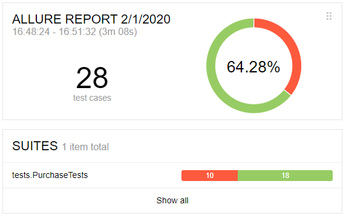

# Отчёт по итогам тестирования
### Краткое описание
Автоматизация тестирования сервиса "Покупка тура" выполнялась с использованием следующих инструментов:
* Docker Desktop
* Java 8
* junit-jupiter: 5.5.1
* selenide: 5.3.1
* allure 2.13.1
* Lombok
* MySql и PostgreSQL

Были протестированы сценарии:
* успешная покупка с дебетовой и кредитной карты
* отказ банка с дебетовой и кредитной картой
* негативные проверки полей: невалидные значения, незаполненные поля

### Количество тест-кейсов

* Всего: 28 тест-кейсов
* Успешных: 18
* Неуспешных: 10

### Общие рекомендации

* Обеспечить документацией данное приложение
* Во всех случаях, когда поля формы остаются не заполненными, реализовать появление предупреждающей надписи "Поле обязательно для заполнения"
* Добавить двухфакторная аутентификация для банковской карты
* Реализовать валидацию имени владельца карты
